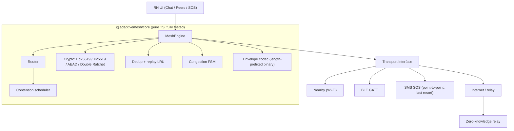

# Architecture

AdaptiveMesh is built around one principle: **all protocol intelligence lives in
a portable, deterministic, pure-TypeScript core.** Transports (Internet, Wi-Fi,
BLE, SMS) are interchangeable, dumb byte pipes. This makes the entire protocol
unit-testable and lets a deterministic simulator reproduce field behavior
exactly.



## Tiered fallback

Tiers are ordered by capability, not preference alone:

| Tier     | Value | Use                                               |
| -------- | ----- | ------------------------------------------------- |
| Internet | 0     | Direct or via zero-knowledge relay when reachable |
| Wi-Fi    | 1     | Nearby Connections P2P_CLUSTER, high throughput   |
| BLE      | 2     | De-Googled fallback; works with no infrastructure |
| SMS      | 3     | **Point-to-point SOS only — never mesh-routed**   |

The engine prefers the lowest-numbered tier that currently has a viable path to
the destination, falling back automatically. SMS is deliberately excluded from
mesh routing: it is a human-confirmed emergency beacon to a known contact, not
a relay hop. Pretending otherwise would be dishonest and would burn the user's
SMS quota; see `THREAT-MODEL.md` and `NOVELTY.md`.

## Envelope

Every message is a length-prefixed binary frame with a signed header and an
AEAD-encrypted payload:

```
Envelope = {
  v            protocol version (1)
  id           ULID (time-sortable, per-message unique)
  traceId      diagnostic correlation id
  src          sender node id = hash(Ed25519 pubkey)
  dst          destination node id (or broadcast)
  ts           sender timestamp (clock-skew tolerant)
  ttl          expiry
  hop          current hop count
  prio         sos | control | normal | bulk
  mode         direct | flood | store-forward | relay | sos
  payloadHash  hash of plaintext for reassembly verification
  chunk        { i, n }  fragment index / total
  cipher       AEAD ciphertext (AES-256-GCM or ChaCha20-Poly1305)
  sig          Ed25519 signature over the canonical header
}
```

The header is signed; the payload is encrypted. Routing nodes verify and act on
the header **without** being able to read the payload. Chunks are reassembled
only after each fragment's hash is verified against `payloadHash`.

## Routing: managed (controlled) flooding

Inspired by Meshtastic but hardened:

- Rebroadcast each unique `(src, id)` **once**, after a randomized contention
  delay, and **suppress** the rebroadcast if a neighbor already relayed it.
- Prefer known direct routes over flooding (the 16-node benchmark shows a single
  air transmission when a direct route exists).
- Hop limit defaults to 3 (max 7); SOS/control frames are prioritized.
- Duplicate + replay suppression via a `(src, id)` LRU keyed by TTL window.
- Congestion FSM: GREEN → YELLOW → ORANGE → RED. At RED only SOS/control frames
  are admitted. Backoff is exponential with jitter.
- Anti-entropy digest exchange lets reconnected partitions reconcile missed
  messages.

## Sessions & forward secrecy

Pairwise sessions use a **Double Ratchet** (`packages/core/src/session`):
X25519 DH ratchet + HKDF-SHA256 symmetric chains, AEAD per message with the
header bound as associated data. Out-of-order and dropped messages are handled
via bounded skipped-key storage (`MAX_SKIP = 1000`). This provides forward
secrecy and post-compromise security even over lossy, high-latency mesh links.

Trust is **TOFU** (trust on first use): a node id _is_ the hash of its signing
key, so identity is self-certifying; key changes raise an explicit warning.

## Zero-knowledge relay

When the Internet tier is available, a relay provides store-and-forward across
partitions **without learning anything about content or social graph beyond
routing metadata it cannot avoid**:

- Clients authenticate with a signed, timestamped, nonce'd request (replay- and
  skew-protected).
- The relay stores **opaque ciphertext blobs** addressed to a destination node
  id; it never holds keys and cannot decrypt.
- Per-destination quotas, payload-size caps, token-bucket rate limiting, and
  SOS prioritization prevent abuse.
- A test asserts the serialized relay state contains no secret material and that
  blobs round-trip byte-for-byte.

The reference server uses only `node:http` (zero dependencies, runs in the test
suite). A production `server.ts` Fastify + Postgres adapter is included but
excluded from typecheck because its dependencies cannot be installed offline.
